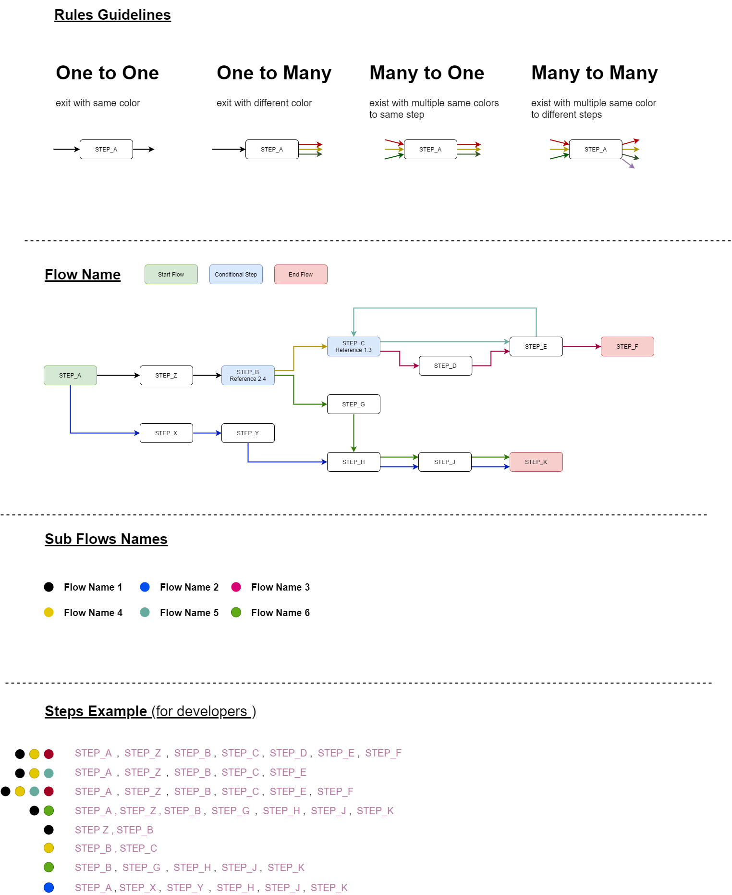
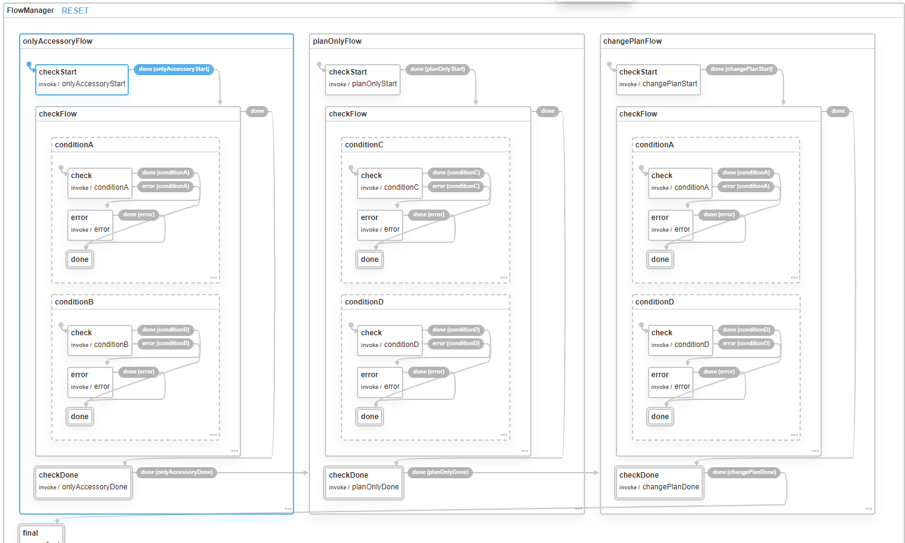

# redux-flow-manager
Flow Manager help you to manage flow information details and steps ( such what is the next step in the flow )
<br/>
for complicated website relay onf lows such a eCommerce, buy flow etc ..
<br/>
Flow Manger using [XState](https://github.com/davidkpiano/xstate) for state machine to calculate where are you currently in the flow and where you need to go.


## Motivation

redux-flow-manager created to help you manage application based flows. <br />
In the flow diagram below you can see example of one flow that can be in your application. <br />
In that flow diagram, each **color is sub flow**, and green and red steps are start and end flow. <br />
Redux Flow Manager help you to manage this sub flows and get decisions where you are and where you need to go.<br />

<br />

<a href="assets/FlowDiagram.png" rel="some text"></a>

## Install

```bash
npm install --save redux-flow-manager
```


## Usage

Check out the the example in the files `app.ts` and `flowManger.browser.ts` in the [test folder](https://github.com/refaelok/redux-flow-manager/tree/master/test).


**Step 1:** Add the flow manager reducer to your project.

```jsx
import { combineReducers } from 'redux';
import { flowManagerReducer } from 'redux-flow-manager';

const rootReducer = combineReducers({
	flowManager: flowManagerReducer
});

...
```

**Step 2:** Create Steps Configuration file - steps config define the set of steps for each sub flow types.
(config files properties are explained below. [Steps Configuration](#steps-configuration)


**Step 3:** Create Flows Configuration file - flow config file define the sub flow types name and the conditions that should be success to make this sub flow valid.
(config files properties are explained below. [Flows Configuration](#flows-configuration)


**Step 4:** Call `CreateFlowManagerAPI` with your store, reducer slice name, flows configuration and steps configuration.
( more details of how configuration should be look like will explain later )

```jsx
// ./index.js
import store from './store';
import CreateFlowManagerAPI from 'redux-flow-manager';

export default CreateFlowManagerAPI(store, 'flowManager', flowsConfig, stepsConfig);
```

**Step 5:** `CreateFlowManagerAPI` return an instance of Flow Manager with functionality that will help you manage flows in your app.

```jsx
// ./SomeComponent.jsx

class App extends SomeComponent {
    // will set teh main flow type when clock on button
    render() {
        return (
            <button onClick={() => flowManagerAPI.startFlow('CHQ', true);}>
                Start CHQ Flow
            </button>
        );
    }
}
```

```jsx
// ./OtherComponent


class App extends OtherComponent {
    // get the next step
    const nextStep = flowManagerAPI.getNextStep();

    render() {
        return (
            <button onClick={() => redirectToStep(nextStep)}>
                Move to Next Step
            </button>
        );
    }
}
```


## Store Structure

```ts
interface FlowManagerState {
	flowType: string;
	subFlowTypes: Array<string>;
	currentStep: string;
	nextStep: string;
	steps: Array<string>;
}
```


## Initial Flow Manager

### CreateFlowManagerAPI(store, sliceName, flowsConfig, stepsConfig);

Create new instance of flow manager.
All the API methods of flow manager describe below.

##### arguments:

| Property | Type | Required | Default | Description |
|:--------------|:--------------|:--------------|:--------------|:--------------|
| `store` | object | Required | undefined | Pass in the redux store. |
| `sliceName` | string | Required | undefined | the name of the reducer slice |
| `flowsConfig` | SubFlowsConfig | Required | undefined | [Flows Configuration](#flows-configuration)) |
| `stepsConfig` | StepsConfig | Required | undefined | [Steps Configuration](#steps-configuration)) |


<br />

## Start and End Flow

### async startFlow(flowType, autoUpdate, currentStep)

Start flow is used when your app should initial the main flow type in the store.
That flow type represent a set of sub flow types in your [Flows Configuration](#flows-configuration)

##### arguments:

| Property | Type | Required | Default | Description |
|:--------------|:--------------|:--------------|:--------------|:--------------|
| `flowType` | string | Required | undefined | The flow type that represent a set of sub flow types [Flows Configuration](#flows-configuration) |
| `autoUpdate` | boolean | Optional | undefined | Optionally pass indicate to automatic run state machine calculator to calculate the flow information data for any change in store |
| `currentStep` | string | Optional | undefined | Initial specific step by start the flow instead of the first step that define in steps array |

### endFlow()

End the flow. Clear all the data from flow manager.

##### arguments:

None


<br />

## Steps Actions

### async updateInformation()

Update Information running the state machine to calculate the sub flows condition and update the steps information and sub flows.

**NOTE**: If you call `startFlow` with `autoUpdate` true, this method invoke automatic for every change in store.
This is very useful for auto calculation nd update your component automatic without worry when to call to updateInformation.

##### arguments:

None

### async nextStep(step?)

Update Information, then <b />
Next Step method update the current step with the next step and the next step with the new next step<br />
return the next step value.

**NOTE**: next step is async due to he running `updateInformation` before update your store with next step.
this is make sure that you have the latest calculated next step before you redirect to other page or move to your next page.

##### arguments:

| Property | Type | Required | Default | Description |
|:--------------|:--------------|:--------------|:--------------|:--------------|
| `step` | string | Optional | currentStep | Optional to pass the step move to. by default it move to the next step according to steps array.

### async isLastStep()

Update Information, then <b />
Return if the current step is the last step.

**NOTE**: If you call `startFlow` with `autoUpdate` true, this method invoke automatic for every change in store.
This is very useful for auto calculation nd update your component automatic without worry when to call to updateInformation.

##### arguments:

None


<br />

## Selectors

Each Selector return the corresponding value from the store.

**NOTE** is not recommended to use directly with selector.<br />
Use Step Actions async methods to get the most updated result before navigate to next step for example.

- getFlowType()
- getSubFlowTypes()
- getCurrentStep()
- getSteps()
- getNextStep()


<br />

### Flows Configuration

Flows Config is an array of object, that each object define the sub flow that may be in your entire application.<br />
Each flow object have conditions array taht each condition include callback.
that callback can check anything related to the condition, if the condition you check is success then return resolve, if the condition is failed then return reject.

If all conditions of a sub flow pass, then this sub flow added to the subFlowTypes array 

Flow Object Properties:

- `flowName: string` - unique name of the sub flow type
- `conditions: array` - an array of Condition Object
- `conditionName: string` - the name of the condition
- `onCheck: function` - a `promise` function that return `resolve` when the condition success and `reject` if the condition should be failed
- `mandatory: boolean` - optional property. define if to remove that sub flow from the array if this condition failed. true by default.

**NOTE** The Order of the Flow Objects in the array are matter.
The checks will run by that order.

```js
const flowsConfig = [
	{
		flowName: 'planOnlyFlow',
		conditions: [
			{
				conditionName: 'conditionA',
				onCheck: conditionA
			},
			{
				conditionName: 'conditionB',
				onCheck: conditionB,
				mandatory: false
			}
		]
	},
	{
		flowName: 'onlyAccessoryFlow',
		conditions: [
			{
				conditionName: 'conditionC',
				onCheck: conditionC
			},
			{
				conditionName: 'conditionD',
				onCheck: conditionD
			}
		]
	},
	{
		flowName: 'changePlanFlow',
		conditions: [
			{
				conditionName: 'conditionA',
				onCheck: conditionA
			},
			{
				conditionName: 'conditionD',
				onCheck: conditionD
			}
		]
	}
];
```

<br />

### Steps Configuration

Steps configuration define for each flow and sub flow, the set of steps that the user need to complete in your application.

Step Object Properties:

- `key: flowType` (Example: `COP`) - the key represent the `flowType`
- `key: subFlowType` (Example: `planOnlyFlow`) - represent the `subFlowType`
- `stesp: array` - set of steps for this `flowType` and `subFlowType`

**NOTE** The Order of the Sub flow Objects in the object are matter.
The checks will run by that order.
For example: if you put `planOnlyFlow` before `planOnlyFlow,changePlanFlow`, then `planOnlyFlow` always wil be set before `planOnlyFlow,changePlanFlow`.

```js
const stepsConfig = {
	COP: {
		onlyAccessoryFlow: {
			steps: [
				'STEP_A',
				'STEP_B',
				'STEP_C',
			]
		}
	},
	CHQ: {
		'planOnlyFlow,changePlanFlow': {
			steps: [
				'STEP_R',
				'STEP_T',
				'STEP_X',
			]
		},
		planOnlyFlow: {
			steps: [
				'STEP_B',
				'STEP_C',
				'STEP_D',
			]
		},
		changePlanFlow: {
			steps: [
				'STEP_A',
				'STEP_D',
				'STEP_E',
			]
		}
	}
};
```


<br />

### XState

### getMachineFlowConfig()

Return an XState config that can be set in XState visualizer to see your state machine created by your config.

##### arguments:

None


<br />

[XState Visualizer](https://xstate.js.org/viz/?gist=cebc9af156574bc7eea62b99292e3f56)


## License

MIT
